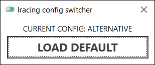

# IracingConfigSwitcher

Allow Iracing configuration switching between a default (VR?) and an alternative (screen?) version.

Manage `app.ini` and `rendererDX11.ini` files.

# Getting started

1. Execute the application
2. Click on "Load alternative" button: a copy of the current configuration is perfomed.
3. Now any change to `app.ini` or `rendererDX11.ini` is specific to the loaded configuration.

# Under the hood

File backups are performed within the current (binary) folder.

Respectively:
- app.default.ini
- app.alternative.ini
- rendererDX11.default.ini
- rendererDX11.alternative.ini
